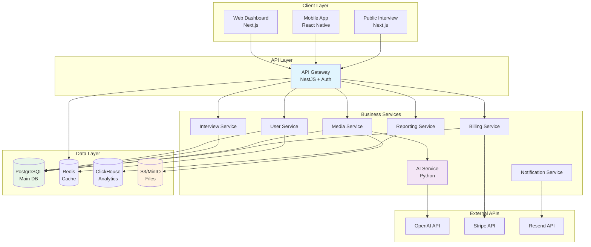

# 🎯 AI Video Interview Platform - Архитектурная документация

Полная архитектурная документация для платформы асинхронных AI-видеоинтервью.

---

## 📋 Обзор проекта

**AI Video Interview Platform** - это масштабируемая платформа, где рекрутеры могут отправлять кандидатам ссылки для прохождения асинхронных интервью (видео или аудио), а затем получать автоматический анализ и расшифровку ответов с помощью AI.

### 🎯 Ключевые возможности
- ✅ Создание кастомных интервью с вопросами
- ✅ Генерация публичных ссылок для кандидатов  
- ✅ Запись видео/аудио ответов в браузере
- ✅ AI-анализ речи и содержания (Whisper + GPT-4)
- ✅ Автоматические отчеты и оценки
- ✅ Система уведомлений и интеграций
- ✅ Многоуровневые тарифные планы

---

## 📚 Структура документации

### 🏗️ [01. Bounded Contexts](./architecture/01-bounded-contexts.md)
**Domain-Driven Design декомпозиция системы**

Система разделена на **8 bounded contexts**:
- 🔐 **Identity & Access** - Аутентификация и авторизация
- 🎯 **Interview Management** - Управление интервью  
- 🎬 **Media Processing** - Обработка медиафайлов
- 🤖 **AI Analysis** - Анализ речи и содержания
- 💰 **Billing & Subscription** - Платежи и подписки
- 📧 **Notification** - Уведомления и интеграции
- 📊 **Reporting & Analytics** - Отчеты и аналитика
- 🎭 **Candidate Response** - Публичная часть для кандидатов

### 🔗 [02. Схемы взаимодействия](./architecture/02-system-interactions.md)
**Диаграммы архитектуры и взаимодействий**

Включает:
- 🏛️ **C4 диаграммы** (Context + Container)
- 📋 **Sequence диаграммы** для ключевых сценариев
- 🔄 **Event Flow** диаграммы
- 🏗️ **Инфраструктурные схемы**
- 📊 **Data Flow** диаграммы

### 🗄️ [03. Архитектура баз данных](./architecture/03-database-architecture.md) 
**Детальный анализ выбора и структуры БД**

Рекомендуемый стек:
- **PostgreSQL** - основная OLTP база данных
- **Redis** - кэширование и сессии
- **ClickHouse** - аналитика и метрики (OLAP)
- **S3/MinIO** - объектное хранилище медиафайлов
- **Elasticsearch** - полнотекстовый поиск (опционально)

### 🚀 [04. План реализации](./architecture/04-implementation-roadmap.md)
**Пошаговый roadmap от MVP до Production**

**4 основных фазы разработки:**
- **Phase 1: MVP Foundation** (6-8 недель) - Базовая функциональность
- **Phase 2: AI Integration** (4-6 недель) - AI-анализ и отчеты  
- **Phase 3: Production Ready** (4-6 недель) - Платежи, мониторинг, DevOps
- **Phase 4: Advanced Features** (8-10 недель) - Продвинутые возможности

### 📋 [05. Архитектурные решения](./architecture/05-architecture-decisions.md)
**Обоснование технологических выборов и принципов**

Ключевые решения:
- **Микросервисная архитектура** с DDD принципами
- **Event-driven** взаимодействие через Kafka
- **CQRS** паттерн для разделения чтения/записи
- **Multi-tenant** архитектура с Row-Level Security

---

## 🛠️ Технологический стек

### Backend
```yaml
Primary Framework: NestJS (TypeScript)
AI Service: FastAPI (Python)
Message Queue: Apache Kafka
API Gateway: NestJS + BetterAuth
```

### Frontend  
```yaml
Framework: Next.js 14+ (App Router)
UI Library: Shadcn/ui + Tailwind CSS
Authentication: BetterAuth
```

### Infrastructure
```yaml
Orchestration: Kubernetes + Helm
Monitoring: Prometheus + Grafana + Loki
CI/CD: GitHub Actions + ArgoCD
Cloud: AWS/GCP (с поддержкой multi-cloud)
```

### AI & Analytics
```yaml
Speech-to-Text: OpenAI Whisper
Content Analysis: GPT-4 + LlamaIndex
Analytics: ClickHouse
Search: Elasticsearch (опционально)
```

---

## 📊 Архитектурная схема (High-Level)



---

## 🚀 Быстрый старт

### Предварительные требования
```bash
# Необходимые инструменты
- Node.js 18+
- Python 3.9+
- Docker & Docker Compose
- Kubernetes (minikube для dev)
- PostgreSQL 15+
- Redis 7+
```

### Локальная разработка
```bash
# Клонирование и настройка
git clone <repository>
cd ai-video-interview

# Установка зависимостей
npm install
cd packages && npm run install:all

# Настройка окружения
cp .env.example .env
# Настройте переменные окружения

# Запуск инфраструктуры
docker-compose up -d postgres redis kafka minio

# Миграции БД
npm run db:migrate

# Запуск сервисов в dev режиме
npm run dev
```

### Production развертывание
```bash
# Helm deployment
helm repo add ai-interview ./k8s/helm
helm install ai-interview ./k8s/helm/ai-interview \
  --namespace ai-interview \
  --create-namespace \
  --values values-production.yaml
```

---

## 📈 Roadmap и Milestones

### 🎯 MVP (Недели 1-8)
- [x] Базовая аутентификация и RBAC
- [x] CRUD интервью с публичными ссылками  
- [x] Запись и загрузка медиафайлов
- [x] Базовая обработка видео/аудио

### 🤖 AI Integration (Недели 9-12)
- [ ] Whisper транскрипция
- [ ] GPT-4 анализ содержания
- [ ] Генерация отчетов
- [ ] Email уведомления

### 🚀 Production Ready (Недели 13-18)
- [ ] Stripe интеграция
- [ ] Kubernetes деплой
- [ ] Мониторинг и алерты
- [ ] Load testing

### 🌟 Advanced Features (Недели 19-26)
- [ ] Computer Vision анализ
- [ ] Real-time аналитика
- [ ] API интеграции и webhooks
- [ ] Mobile приложения

---

## 👥 Команда и роли

```yaml
Рекомендуемый состав команды:
  Backend Developers: 2-3 (NestJS, Python)
  Frontend Developer: 1-2 (Next.js, React)
  DevOps Engineer: 1 (Kubernetes, CI/CD)
  AI/ML Engineer: 1 (OpenAI, ML models)
  QA Engineer: 1 (Testing, automation)
  Product Manager: 1
  UI/UX Designer: 1
```

---

## 💰 Оценка бюджета

### Разработка (MVP)
```yaml
Команда (6-8 недель): $50,000 - $80,000
External Services: $2,000 - $5,000
Infrastructure (dev): $1,000 - $2,000
Total MVP: $53,000 - $87,000
```

### Операционные расходы (месячно)
```yaml
Infrastructure: $1,150 - $5,300
AI API (OpenAI): $200 - $2,000
Monitoring & Tools: $300 - $500
Total Monthly: $1,650 - $7,800
```

---

## 📞 Support & Contributing

### Документация
- [API Documentation](./api-docs.md)
- [Deployment Guide](./deployment.md) 
- [Troubleshooting](./troubleshooting.md)

### Contributing
1. Fork репозиторий
2. Создайте feature branch
3. Commit изменения
4. Push в branch
5. Создайте Pull Request

### Issues & Support
- GitHub Issues для багов и feature requests
- Slack канал для обсуждений команды
- Документация и runbooks в Confluence

---

## 📝 License

MIT License - см. [LICENSE](../LICENSE) файл для деталей.

---

**Последнее обновление:** Январь 2024  
**Версия архитектуры:** 1.0  
**Статус:** Ready for Implementation
