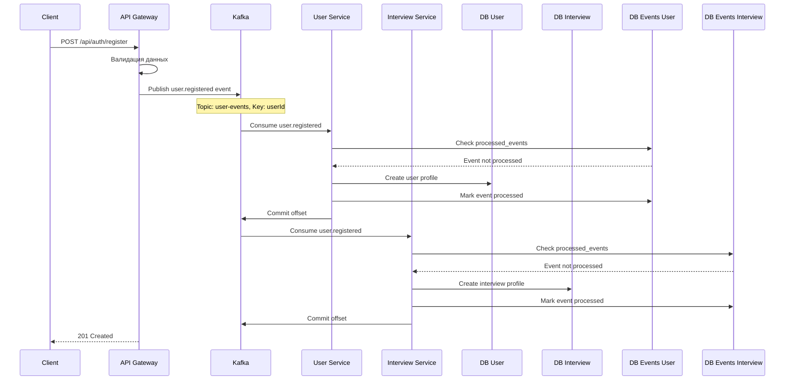
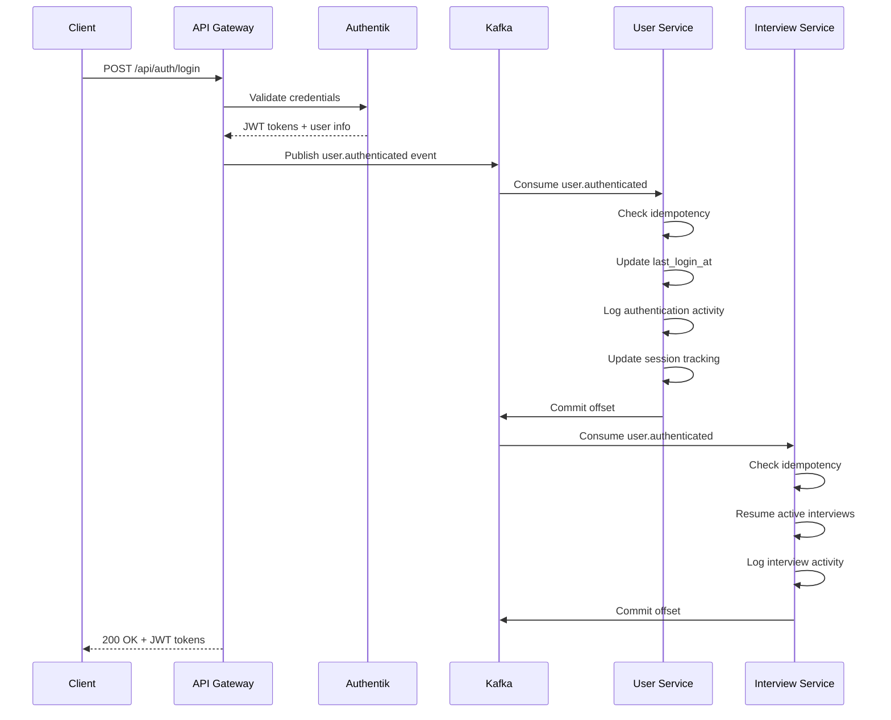
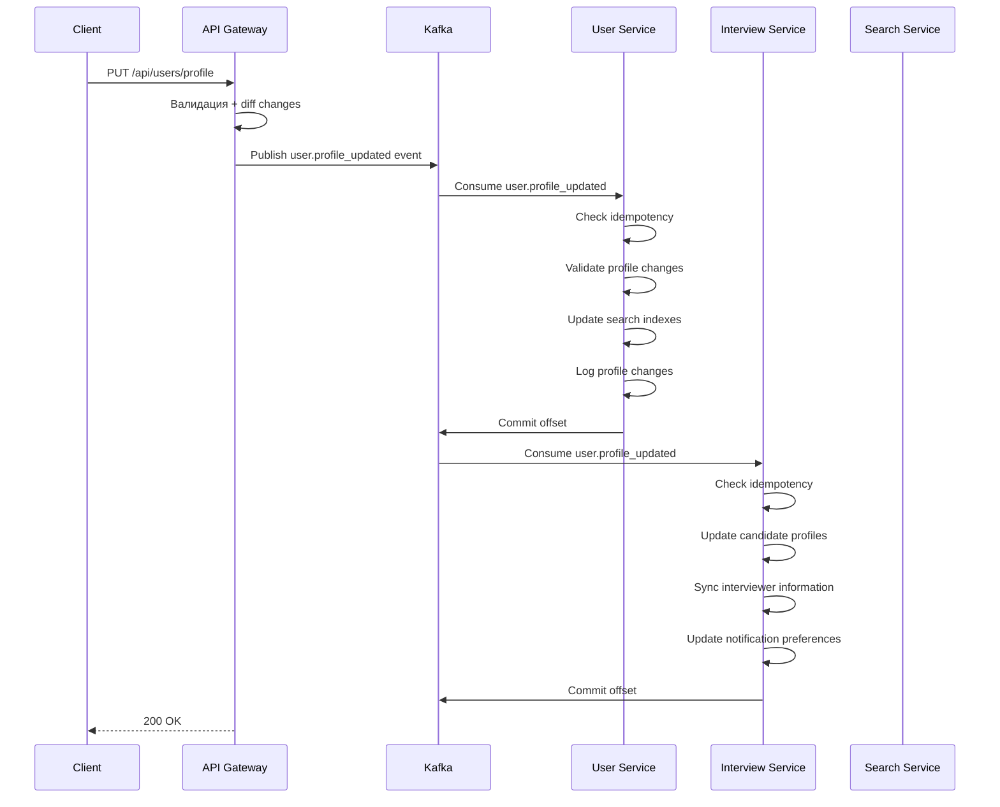
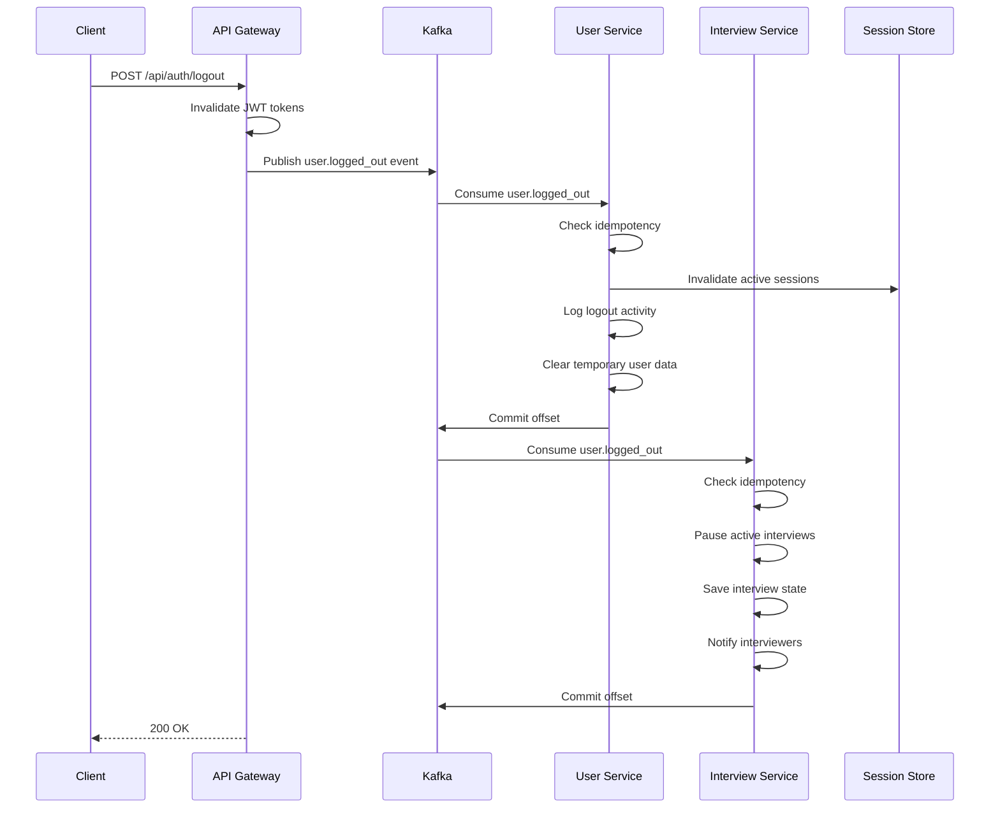
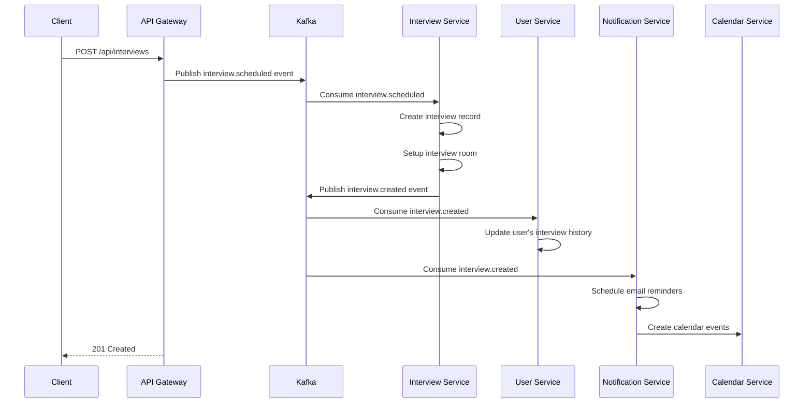
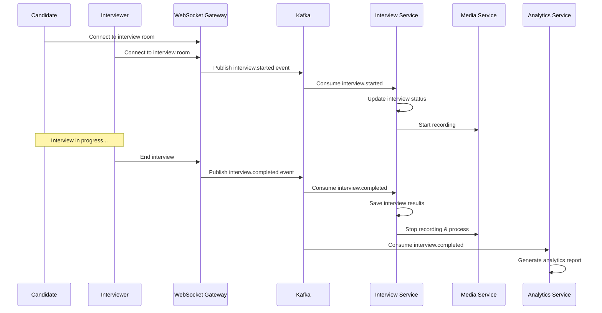

# Use Cases и Event Flow — AI Video Interview Platform

Детальное описание реализованных и планируемых пользовательских сценариев с пошаговым flow, включая таблицы БД, Kafka-события и межсервисную интеграцию.

---

## 📋 Содержание

1. [Текущее состояние реализации](#текущее-состояние-реализации)
2. [Архитектура событий](#архитектура-событий)
3. [Use Case 1: Регистрация пользователя](#use-case-1-регистрация-пользователя)
4. [Use Case 2: Аутентификация пользователя](#use-case-2-аутентификация-пользователя)
5. [Use Case 3: Обновление профиля](#use-case-3-обновление-профиля)
6. [Use Case 4: Выход из системы](#use-case-4-выход-из-системы)
7. [Use Case 5: Создание интервью (планируется)](#use-case-5-создание-интервью-планируется)
8. [Use Case 6: Проведение интервью (планируется)](#use-case-6-проведение-интервью-планируется)
9. [Таблицы идемпотентности](#таблицы-идемпотентности)
10. [Troubleshooting событий](#troubleshooting-событий)

---

## 🚀 Текущее состояние реализации

### ✅ Полностью реализовано
- **Kafka-инфраструктура**: продьюсеры, консьюмеры, топики, DLQ
- **Идемпотентность**: таблицы `processed_events` в User и Interview Service
- **Ручной коммит оффсетов**: exactly-once processing гарантии
- **Event listeners**: подписки на `user-events` в обоих сервисах
- **Graceful shutdown**: корректная остановка всех сервисов

### 🔄 В стадии разработки (TODO)
- **Бизнес-логика обработчиков**: пока только логирование + TODO комментарии
- **Базы данных доменов**: таблицы Users, Interviews, Sessions
- **API эндпоинты**: REST/GraphQL для публикации событий
- **Notification Service**: отправка email/push уведомлений

### 📐 Архитектурные принципы
- **Event Sourcing**: все изменения состояния через события
- **CQRS**: разделение команд (write) и запросов (read) 
- **Saga Pattern**: координация долгих транзакций через события
- **Exactly-Once Processing**: защита от дублирования событий

---

## 🏗️ Архитектура событий

### Kafka Topics и Consumer Groups
```
Topic: user-events (3 partitions)
├── user-service-group (User Service)
│   └── Обновление пользовательских данных
├── interview-service-group (Interview Service)  
│   └── Синхронизация интервью-профилей
└── notification-service-group (планируется)
    └── Отправка уведомлений

Topic: interview-events (3 partitions) 
├── user-service-group
│   └── Обновление статистики пользователя
├── interview-service-group
│   └── Управление жизненным циклом интервью
└── analytics-service-group (планируется)
    └── Сбор метрик интервью
```

### Event Schema (BaseEvent)
```typescript
interface BaseEvent {
  eventId: string;        // UUID для идемпотентности
  eventType: string;      // "user.registered", "interview.scheduled" 
  timestamp: number;      // Unix timestamp (мс)
  version: string;        // Версия схемы события
  source: string;         // Источник: "api-gateway", "user-service"
  payload: object;        // Данные события
}
```

### Partitioning Strategy
- **Ключ партиционирования**: `userId` (гарантия порядка событий пользователя)
- **Количество партиций**: 3 (масштабирование до 3 консьюмеров на группу)
- **Replication Factor**: 1 (dev), 3+ (production)

---

## 📝 Use Case 1: Регистрация пользователя

**Триггер**: POST `/api/auth/register` в API Gateway  
**Цель**: Создать нового пользователя в системе и инициализировать его профили во всех сервисах

### Детальный Flow



### Структура события
```typescript
{
  eventId: "550e8400-e29b-41d4-a716-446655440000",
  eventType: "user.registered",
  timestamp: 1693891200000,
  version: "1.0",
  source: "api-gateway",
  payload: {
    userId: "123e4567-e89b-12d3-a456-426614174000",
    email: "john.doe@example.com",
    firstName: "John", 
    lastName: "Doe",
    registrationMethod: "authentik",
    ipAddress: "192.168.1.100",
    userAgent: "Mozilla/5.0..."
  }
}
```

### Таблицы и изменения

#### User Service (DB: ai_video_interview_user)
**Таблица: users** (планируется)
```sql
INSERT INTO users (id, email, first_name, last_name, created_at, registration_method)
VALUES ('123e4567-e89b-12d3-a456-426614174000', 'john.doe@example.com', 'John', 'Doe', NOW(), 'authentik');
```

**Таблица: processed_events**
```sql
INSERT INTO processed_events (event_id, event_type, service_name, processed_at, event_data)
VALUES ('550e8400-e29b-41d4-a716-446655440000', 'user.registered', 'user-service', NOW(), '{"userId": "123e..."}');
```

#### Interview Service (DB: ai_video_interview_interview)
**Таблица: candidate_profiles** (планируется)
```sql
INSERT INTO candidate_profiles (user_id, created_at, status, interview_preferences)
VALUES ('123e4567-e89b-12d3-a456-426614174000', NOW(), 'active', '{}');
```

**Таблица: processed_events**
```sql
INSERT INTO processed_events (event_id, event_type, service_name, processed_at, event_data)
VALUES ('550e8400-e29b-41d4-a716-446655440000', 'user.registered', 'interview-service', NOW(), '{"userId": "123e..."}');
```

### Планируемые действия (TODO)
**User Service:**
- ✅ Логирование регистрации (реализовано)
- 🔄 Отправка welcome email
- 🔄 Создание user profile в БД
- 🔄 Инициализация пользовательских настроек
- 🔄 Настройка ролей по умолчанию

**Interview Service:**
- ✅ Логирование регистрации (реализовано)
- 🔄 Создание interview profile
- 🔄 Инициализация interview preferences
- 🔄 Настройка шаблонов интервью по умолчанию
- 🔄 Отправка onboarding interview invitation

### Идемпотентность
- Уникальность по `(event_id, service_name, event_type)`
- При повторной доставке события — пропуск обработки
- Коммит оффсета только после успешной обработки + записи в `processed_events`

---

## 🔐 Use Case 2: Аутентификация пользователя

**Триггер**: POST `/api/auth/login` или OAuth callback  
**Цель**: Аутентифицировать пользователя и обновить сессионное состояние

### Детальный Flow



### Структура события
```typescript
{
  eventId: "660e8400-e29b-41d4-a716-446655440001",
  eventType: "user.authenticated", 
  timestamp: 1693891260000,
  version: "1.0",
  source: "api-gateway",
  payload: {
    userId: "123e4567-e89b-12d3-a456-426614174000",
    email: "john.doe@example.com",
    authMethod: "oauth2",
    sessionId: "sess_789e4567-e89b-12d3-a456-426614174002",
    ipAddress: "192.168.1.100",
    userAgent: "Mozilla/5.0..."
  }
}
```

### Планируемые действия (TODO)
**User Service:**
- ✅ Логирование аутентификации (реализовано)
- 🔄 Обновление `users.last_login_at`
- 🔄 Запись в `auth_logs` таблицу
- 🔄 Обновление активных сессий

**Interview Service:**
- ✅ Логирование в interview контексте (реализовано)
- 🔄 Возобновление приостановленных интервью
- 🔄 Обновление статуса активных интервью-сессий
- 🔄 Уведомление интервьюеров о возвращении кандидата

---

## 👤 Use Case 3: Обновление профиля

**Триггер**: PUT `/api/users/profile` в API Gateway  
**Цель**: Синхронизировать изменения профиля между сервисами

### Детальный Flow



### Структура события
```typescript
{
  eventId: "770e8400-e29b-41d4-a716-446655440002",
  eventType: "user.profile_updated",
  timestamp: 1693891320000,
  version: "1.0", 
  source: "api-gateway",
  payload: {
    userId: "123e4567-e89b-12d3-a456-426614174000",
    updatedFields: ["firstName", "phone", "skills"],
    previousValues: {
      firstName: "John",
      phone: null,
      skills: []
    },
    newValues: {
      firstName: "Johnathan", 
      phone: "+1234567890",
      skills: ["JavaScript", "TypeScript", "React"]
    }
  }
}
```

### Планируемые действия (TODO)
**User Service:**
- ✅ Логирование обновления (реализовано)
- 🔄 Валидация изменений профиля
- 🔄 Обновление search indexes (Elasticsearch)
- 🔄 Уведомление других сервисов при необходимости
- 🔄 Аудит-лог изменений профиля

**Interview Service:**
- ✅ Логирование синхронизации (реализовано)
- 🔄 Обновление candidate profiles
- 🔄 Синхронизация информации интервьюера
- 🔄 Обновление preferences уведомлений
- 🔄 Обновление доступности для интервью

---

## 🚪 Use Case 4: Выход из системы

**Триггер**: POST `/api/auth/logout` или token expiration  
**Цель**: Корректно завершить пользовательскую сессию во всех сервисах

### Детальный Flow



### Структура события
```typescript
{
  eventId: "880e8400-e29b-41d4-a716-446655440003",
  eventType: "user.logged_out",
  timestamp: 1693891380000,
  version: "1.0",
  source: "api-gateway", 
  payload: {
    userId: "123e4567-e89b-12d3-a456-426614174000",
    sessionId: "sess_789e4567-e89b-12d3-a456-426614174002",
    logoutReason: "user_action" // "token_expired", "admin_action"
  }
}
```

### Планируемые действия (TODO)
**User Service:**
- ✅ Логирование выхода (реализовано)
- 🔄 Инвалидация активных сессий
- 🔄 Запись logout activity
- 🔄 Очистка временных пользовательских данных

**Interview Service:**
- ✅ Логирование cleanup (реализовано)
- 🔄 Приостановка активных интервью
- 🔄 Сохранение состояния интервью
- 🔄 Очистка временных данных интервью
- 🔄 Уведомление интервьюеров о выходе кандидата

---

## 🎤 Use Case 5: Создание интервью (планируется)

**Триггер**: POST `/api/interviews` в API Gateway  
**Цель**: Создать новое интервью и запланировать уведомления

### Планируемый Flow



### Планируемая структура события
```typescript
{
  eventId: "990e8400-e29b-41d4-a716-446655440004",
  eventType: "interview.scheduled",
  timestamp: 1693891440000,
  version: "1.0",
  source: "api-gateway",
  payload: {
    interviewId: "interview_123e4567-e89b-12d3-a456-426614174003",
    candidateId: "123e4567-e89b-12d3-a456-426614174000", 
    interviewerId: "interviewer_456e7890-e89b-12d3-a456-426614174004",
    scheduledAt: "2025-09-15T10:00:00Z",
    duration: 60, // minutes
    type: "technical", // "behavioral", "system_design"
    requirements: ["JavaScript", "React", "Node.js"]
  }
}
```

---

## 🎥 Use Case 6: Проведение интервью (планируется)

**Триггер**: WebSocket connection к interview room  
**Цель**: Управлять состоянием интервью в реальном времени

### Планируемый Flow



---

## 🗃️ Таблицы идемпотентности

Каждый сервис имеет свою таблицу `processed_events` для предотвращения дублирования:

### User Service (ai_video_interview_user.processed_events)
```sql
SELECT event_id, event_type, service_name, processed_at, event_data 
FROM processed_events 
WHERE service_name = 'user-service'
ORDER BY processed_at DESC;
```

**Пример записей:**
| event_id | event_type | service_name | processed_at | event_data |
|----------|------------|--------------|--------------|------------|
| 550e8400... | user.registered | user-service | 2025-09-05 15:30:00 | {"userId": "123e..."} |
| 660e8400... | user.authenticated | user-service | 2025-09-05 15:35:00 | {"userId": "123e..."} |

### Interview Service (ai_video_interview_interview.processed_events)
```sql
SELECT event_id, event_type, service_name, processed_at, event_data
FROM processed_events  
WHERE service_name = 'interview-service'
ORDER BY processed_at DESC;
```

**Пример записей:**
| event_id | event_type | service_name | processed_at | event_data |
|----------|------------|--------------|--------------|------------|
| 550e8400... | user.registered | interview-service | 2025-09-05 15:30:01 | {"userId": "123e..."} |
| 770e8400... | user.profile_updated | interview-service | 2025-09-05 15:40:00 | {"userId": "123e..."} |

### Уникальность и индексы
- **Уникальный индекс**: `(event_id, service_name, event_type)`
- **Поисковые индексы**: `event_id`, `service_name`, `processed_at`, `event_type`
- **Очистка старых записей**: автоматическая через 30 дней (планируется)

---

## 🔧 Troubleshooting событий

### Частые проблемы и решения

#### 1. Событие не обрабатывается
**Симптомы**: Событие попало в Kafka, но не обработалось консьюмером
**Возможные причины**:
- Ошибка в бизнес-логике обработчика
- Недоступность базы данных
- Неправильный формат события

**Диагностика**:
```sql
-- Проверить, было ли событие обработано
SELECT * FROM processed_events WHERE event_id = 'your-event-id';

-- Если записи нет - событие не дошло до обработчика или упало с ошибкой
```

**Решение**:
1. Проверить логи консьюмера
2. Проверить DLQ топик: `user-events-dlq`
3. При необходимости - replay события из Kafka

#### 2. Дублирование обработки
**Симптомы**: Одно событие обработано несколько раз
**Возможные причины**:
- Нарушение уникального индекса `processed_events`
- Race condition между консьюмерами
- Ручной replay событий

**Диагностика**:
```sql
-- Найти дублированные события
SELECT event_id, event_type, service_name, COUNT(*) as count
FROM processed_events 
GROUP BY event_id, event_type, service_name 
HAVING COUNT(*) > 1;
```

#### 3. Отставание консьюмера (Consumer Lag)  
**Симптомы**: События обрабатываются с большой задержкой
**Возможные причины**:
- Медленная бизнес-логика
- Недостаточно консьюмеров в группе
- Проблемы с сетью/БД

**Диагностика**:
- Kafka UI: http://localhost:8080 (если Kafka поднят)
- Metrics: consumer lag, processing time

### Полезные команды для отладки

#### Kafka Consumer Groups
```bash
# Список consumer groups
docker exec ai-interview-kafka kafka-consumer-groups.sh --bootstrap-server localhost:9092 --list

# Статус группы user-service-group
docker exec ai-interview-kafka kafka-consumer-groups.sh --bootstrap-server localhost:9092 --group user-service-group --describe

# Сброс оффсетов на начало (осторожно!)
docker exec ai-interview-kafka kafka-consumer-groups.sh --bootstrap-server localhost:9092 --group user-service-group --reset-offsets --to-earliest --all-topics --execute
```

#### Просмотр топиков
```bash
# Список топиков
docker exec ai-interview-kafka kafka-topics.sh --bootstrap-server localhost:9092 --list

# Последние 10 сообщений из user-events
docker exec ai-interview-kafka kafka-console-consumer.sh --bootstrap-server localhost:9092 --topic user-events --from-beginning --max-messages 10
```

#### База данных
```sql
-- Статистика обработанных событий
SELECT 
    service_name,
    event_type,
    DATE(processed_at) as date,
    COUNT(*) as events_count
FROM processed_events 
GROUP BY service_name, event_type, DATE(processed_at)
ORDER BY date DESC, service_name, event_type;

-- События за последний час
SELECT event_id, event_type, service_name, processed_at
FROM processed_events 
WHERE processed_at > NOW() - INTERVAL '1 hour'
ORDER BY processed_at DESC;
```

---

## 📊 Метрики и мониторинг (планируется)

### Ключевые метрики
- **Event Processing Rate**: события/секунду по типам
- **Consumer Lag**: отставание консьюмеров по партициям  
- **Error Rate**: % событий, отправленных в DLQ
- **Processing Time**: время обработки события
- **Idempotency Hits**: % дублированных событий

### Алерты
- Consumer lag > 1000 сообщений
- Error rate > 5%
- DLQ growth > 10 сообщений/минуту
- Processing time > 30 секунд

---

Это детальное описание текущего состояния и планируемых use cases. Для вопросов и доработок обращайтесь! 🚀
