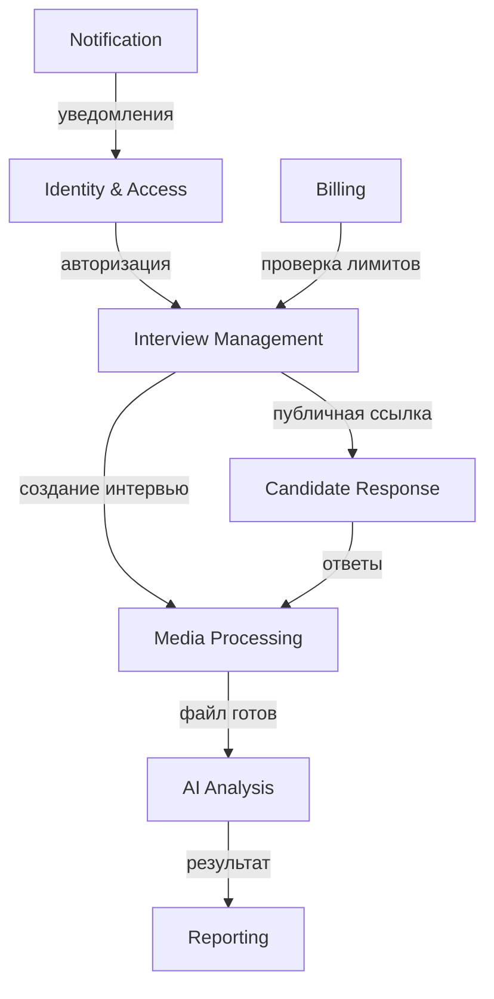

# Bounded Contexts - AI Video Interview Platform

## Обзор Domain-Driven Design

Платформа AI-видеоинтервью разделена на следующие **Bounded Contexts** согласно принципам DDD:

---

## 1. 🔐 **Identity & Access Context**
**Назначение:** Управление пользователями, аутентификация, авторизация

### Сущности и агрегаты:
- **User** (агрегат-корень)
  - UserId, Email, PasswordHash, CreatedAt
  - Profile (FullName, CompanyName, Phone)
- **Role** (сущность)
  - RoleId, Name, Permissions[]
- **Session** (сущность)
  - SessionId, UserId, Token, ExpiresAt

### Ответственность:
- Регистрация и аутентификация пользователей
- RBAC (Role-Based Access Control)
- JWT/Session management
- Password reset, email verification

### Технологии:
- **BetterAuth** (NestJS + Next.js)
- **PostgreSQL** для пользователей и ролей
- **Redis** для сессий

---

## 2. 🎯 **Interview Management Context**
**Назначение:** Создание, управление и конфигурация интервью

### Сущности и агрегаты:
- **Interview** (агрегат-корень)
  - InterviewId, Title, Description, CreatedBy
  - Status (Draft, Active, Completed, Archived)
  - PublicLink, ExpiresAt
- **Question** (сущность)
  - QuestionId, Text, Type (Video/Audio), Order
  - TimeLimit, IsRequired
- **InterviewTemplate** (сущность)
  - TemplateId, Name, Questions[], CreatedBy

### Ответственность:
- CRUD операции с интервью
- Генерация уникальных публичных ссылок
- Управление вопросами и шаблонами
- Валидация доступа по ссылке

### Технологии:
- **PostgreSQL** для структурированных данных
- **UUID** для публичных ссылок

---

## 3. 🎬 **Media Processing Context**
**Назначение:** Обработка, хранение и управление медиафайлами

### Сущности и агрегаты:
- **MediaFile** (агрегат-корень)
  - FileId, InterviewId, QuestionId
  - OriginalPath, ProcessedPath, ThumbnailPath
  - Status (Uploading, Processing, Ready, Failed)
  - Metadata (Duration, Size, Format, Resolution)
- **ProcessingJob** (сущность)
  - JobId, FileId, Status, Progress
  - StartedAt, CompletedAt, ErrorMessage

### Ответственность:
- Загрузка файлов (pre-signed URLs)
- Конвертация и сжатие видео/аудио (ffmpeg)
- Генерация превью и миниатюр
- Управление статусами обработки

### Технологии:
- **S3/MinIO** для хранения файлов
- **FFmpeg** для обработки медиа
- **PostgreSQL** для метаданных
- **Kafka** для асинхронной обработки

---

## 4. 🤖 **AI Analysis Context**
**Назначение:** Анализ речи и содержания с помощью AI

### Сущности и агрегаты:
- **AnalysisResult** (агрегат-корень)
  - ResultId, InterviewId, CandidateId
  - TranscriptionText, ConfidenceScore
  - SentimentAnalysis, KeyWords[]
  - SkillsAssessment, OverallScore
- **AIModel** (сущность)
  - ModelId, Name, Version, Type
  - Config, IsActive
- **AnalysisJob** (сущность)
  - JobId, FileId, ModelId, Status
  - StartedAt, CompletedAt, CostUSD

### Ответственность:
- Транскрипция аудио (Whisper)
- Анализ содержания (GPT-4)
- Оценка soft/hard skills
- Эмоциональный анализ речи

### Технологии:
- **OpenAI API** (Whisper + GPT-4)
- **LlamaIndex** для анализа соответствия JD
- **PostgreSQL** для результатов
- **Python microservice**

---

## 5. 💰 **Billing & Subscription Context**
**Назначение:** Управление подписками, платежами и лимитами

### Сущности и агрегаты:
- **Subscription** (агрегат-корень)
  - SubscriptionId, UserId, PlanId
  - Status (Active, Cancelled, Expired)
  - CurrentPeriodStart, CurrentPeriodEnd
- **Plan** (сущность)
  - PlanId, Name, Price, Currency
  - Limits (InterviewsPerMonth, AnalysisPerMonth)
- **Usage** (сущность)
  - UsageId, UserId, ResourceType
  - Count, Date, ResetDate

### Ответственность:
- Интеграция со Stripe
- Отслеживание использования ресурсов
- Проверка лимитов перед операциями
- Управление тарифными планами

### Технологии:
- **Stripe API**
- **PostgreSQL** для подписок
- **Redis** для кеширования лимитов

---

## 6. 📧 **Notification Context**
**Назначение:** Уведомления по email, webhook, интеграции

### Сущности и агрегаты:
- **Notification** (агрегат-корень)
  - NotificationId, UserId, Type
  - Title, Content, Status
  - SendAt, DeliveredAt
- **NotificationTemplate** (сущность)
  - TemplateId, Type, Subject, Body
  - Variables[]
- **WebhookEndpoint** (сущность)
  - EndpointId, UserId, Url
  - Secret, IsActive, Events[]

### Ответственность:
- Email-уведомления (Resend)
- Webhook интеграции
- Push-уведомления (в будущем)
- Шаблонизация сообщений

### Технологии:
- **Resend** для email
- **Kafka** для событий
- **PostgreSQL** для логов

---

## 7. 📊 **Reporting & Analytics Context**
**Назначение:** Отчеты, аналитика, экспорт данных

### Сущности и агрегаты:
- **Report** (агрегат-корень)
  - ReportId, InterviewId, GeneratedBy
  - Type (PDF, CSV, JSON), Status
  - FilePath, CreatedAt, ExpiresAt
- **Analytics** (сущность)
  - MetricId, UserId, InterviewId
  - MetricName, Value, Date
- **Dashboard** (сущность)
  - DashboardId, UserId, Config
  - Widgets[], IsDefault

### Ответственность:
- Генерация PDF/CSV отчетов
- Сбор аналитики использования
- Дашборды для HR
- Экспорт данных

### Технологии:
- **Puppeteer** для PDF
- **ClickHouse** для аналитики (опционально)
- **PostgreSQL** для отчетов

---

## 8. 🎭 **Candidate Response Context**
**Назначение:** Прохождение интервью кандидатами (публичная часть)

### Сущности и агрегаты:
- **CandidateSession** (агрегат-корень)
  - SessionId, InterviewId, CandidateEmail
  - Status (InProgress, Completed, Abandoned)
  - StartedAt, CompletedAt, UserAgent
- **Response** (сущность)
  - ResponseId, SessionId, QuestionId
  - MediaFileId, Duration, RecordedAt
- **CandidateProfile** (сущность)
  - ProfileId, SessionId, Name, Email
  - Resume, AdditionalInfo

### Ответственность:
- Валидация доступа по публичной ссылке
- Сохранение ответов кандидатов
- Прогресс прохождения
- Сбор дополнительной информации

### Технологии:
- **PostgreSQL** для сессий
- **Next.js** для публичного UI

---

## Взаимодействие между контекстами

## Принципы взаимодействия

1. **Асинхронная связь:** Kafka для событий между контекстами
2. **Синхронная связь:** gRPC/REST для прямых запросов
3. **Eventual Consistency:** Принимаем задержки для масштабируемости
4. **Domain Events:** Каждый контекст публикует события о важных изменениях
