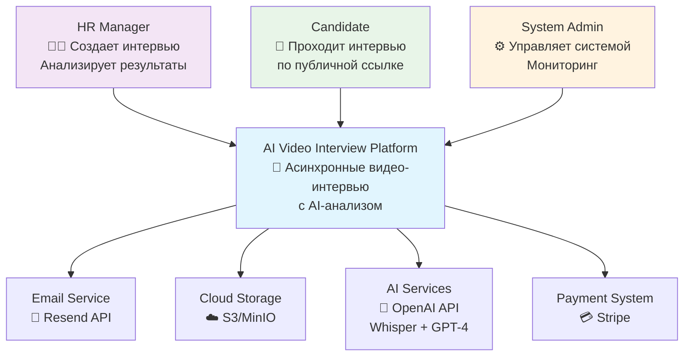
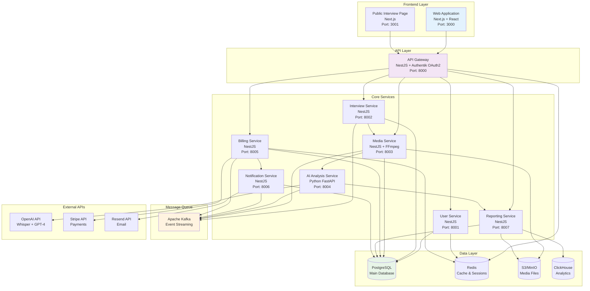
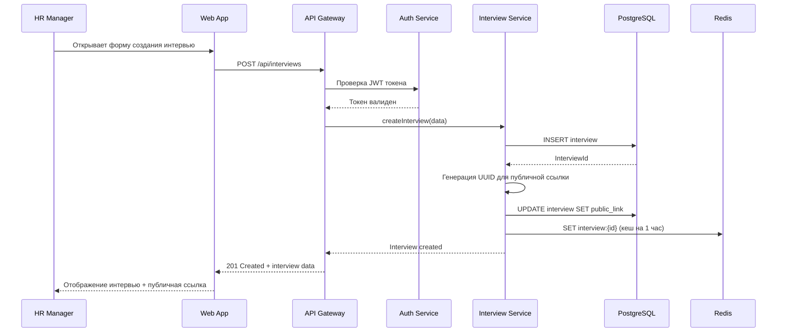
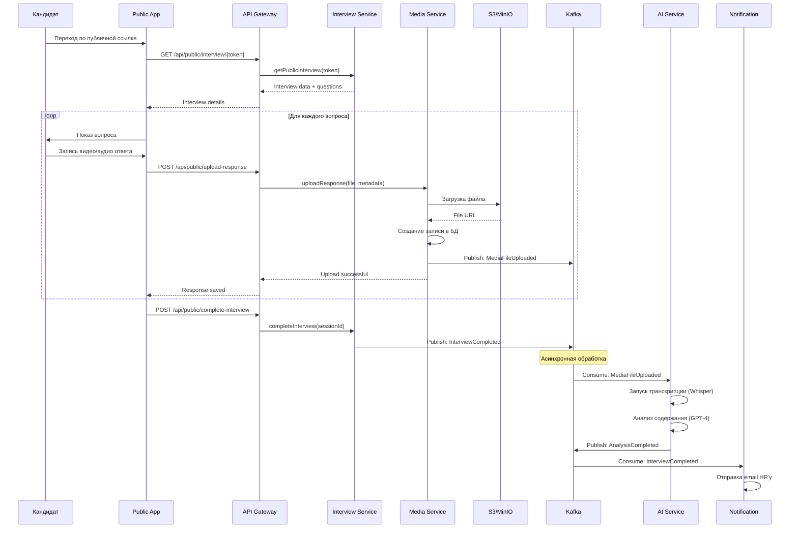
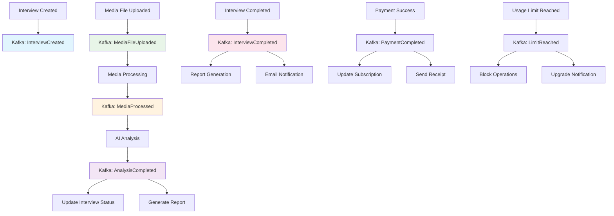
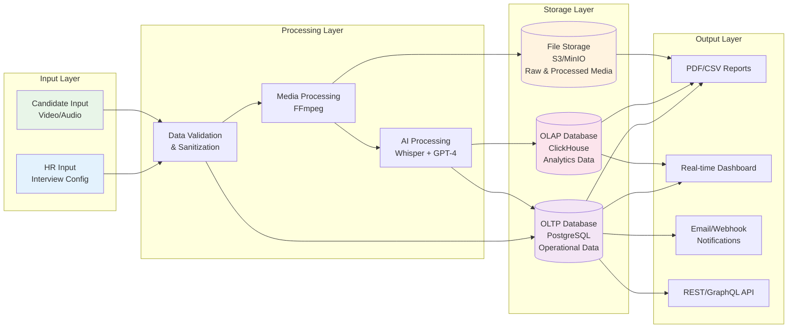

# Схемы взаимодействия системы - AI Video Interview Platform

## 1. 🏗️ Контекстная диаграмма (C4 - Level 1)

---

## 2. 🔗 Диаграмма контейнеров (C4 - Level 2)

---

## 3. 📋 Sequence диаграмма: Создание интервью

---

## 4. 📹 Sequence диаграмма: Прохождение интервью кандидатом

---

## 5. 🔄 Event Flow диаграмма

---

## 6. 🏛️ Инфраструктурная диаграмма

```mermaid
graph TB
    subgraph "Load Balancer"
        LB[NGINX<br/>Load Balancer<br/>SSL Termination]
    end
    
    subgraph "Kubernetes Cluster"
        subgraph "Frontend Namespace"
            WebPod[Web App Pods<br/>Next.js x3]
            PublicPod[Public App Pods<br/>Next.js x2]
        end
        
        subgraph "API Namespace"
            GatewayPod[API Gateway Pods<br/>NestJS x3]
        end
        
        subgraph "Services Namespace"
            UserPod[User Service x2]
            InterviewPod[Interview Service x2]
            MediaPod[Media Service x2]
            AIPod[AI Service x2]
            BillingPod[Billing Service x2]
            NotificationPod[Notification Service x2]
            ReportingPod[Reporting Service x2]
        end
        
        subgraph "Processing Namespace"
            FFmpegPod[FFmpeg Workers x3]
            WhisperPod[Whisper Workers x2]
        end
    end
    
    subgraph "Data Layer"
        PGCluster[(PostgreSQL Cluster<br/>Primary + 2 Replicas)]
        RedisCluster[(Redis Cluster<br/>3 nodes)]
        KafkaCluster[Kafka Cluster<br/>3 brokers]
        ClickHouse[(ClickHouse<br/>Analytics DB)]
    end
    
    subgraph "Storage"
        S3Bucket[S3 Buckets<br/>media-files<br/>reports<br/>backups]
    end
    
    subgraph "Monitoring"
        Prometheus[Prometheus<br/>Metrics]
        Grafana[Grafana<br/>Dashboards]
        Loki[Loki<br/>Logs]
        Alertmanager[Alertmanager<br/>Alerts]
    end
    
    subgraph "External Services"
        OpenAIExt[OpenAI API]
        StripeExt[Stripe API]
        ResendExt[Resend API]
    end
    
    %% Connections
    LB --> WebPod
    LB --> PublicPod
    LB --> GatewayPod
    
    GatewayPod --> UserPod
    GatewayPod --> InterviewPod
    GatewayPod --> MediaPod
    GatewayPod --> BillingPod
    GatewayPod --> ReportingPod
    
    MediaPod --> FFmpegPod
    AIPod --> WhisperPod
    
    UserPod --> PGCluster
    InterviewPod --> PGCluster
    MediaPod --> PGCluster
    BillingPod --> PGCluster
    
    GatewayPod --> RedisCluster
    UserPod --> RedisCluster
    
    InterviewPod --> KafkaCluster
    MediaPod --> KafkaCluster
    AIPod --> KafkaCluster
    NotificationPod --> KafkaCluster
    
    ReportingPod --> ClickHouse
    
    MediaPod --> S3Bucket
    ReportingPod --> S3Bucket
    
    AIPod --> OpenAIExt
    BillingPod --> StripeExt
    NotificationPod --> ResendExt
    
    %% Monitoring connections
    Prometheus --> UserPod
    Prometheus --> InterviewPod
    Prometheus --> MediaPod
    Grafana --> Prometheus
    Loki --> UserPod
    Alertmanager --> Prometheus
    
    style LB fill:#ffcdd2
    style WebPod fill:#e1f5fe
    style PGCluster fill:#e8f5e8
    style KafkaCluster fill:#fff3e0
    style Prometheus fill:#f3e5f5
```

---

## 7. 📊 Диаграмма потоков данных

---

## Принципы проектирования

### 🔒 Безопасность
- **JWT токены** для аутентификации
- **RBAC** для авторизации
- **Pre-signed URLs** для загрузки файлов
- **Rate limiting** на API Gateway
- **Input validation** на всех уровнях

### 📈 Масштабируемость
- **Горизонтальное масштабирование** сервисов
- **Асинхронная обработка** через Kafka
- **Кеширование** в Redis
- **CDN** для статических файлов
- **Database sharding** (при необходимости)

### 🔄 Надежность
- **Circuit breaker** pattern
- **Retry mechanisms** с exponential backoff
- **Health checks** для всех сервисов
- **Graceful shutdown**
- **Data backup** и disaster recovery

### 📊 Мониторинг
- **Distributed tracing** (Jaeger)
- **Metrics collection** (Prometheus)
- **Log aggregation** (Loki)
- **Error tracking** (Sentry)
- **Performance monitoring** (APM)
