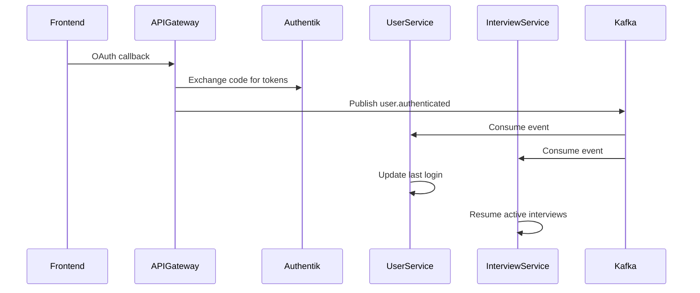
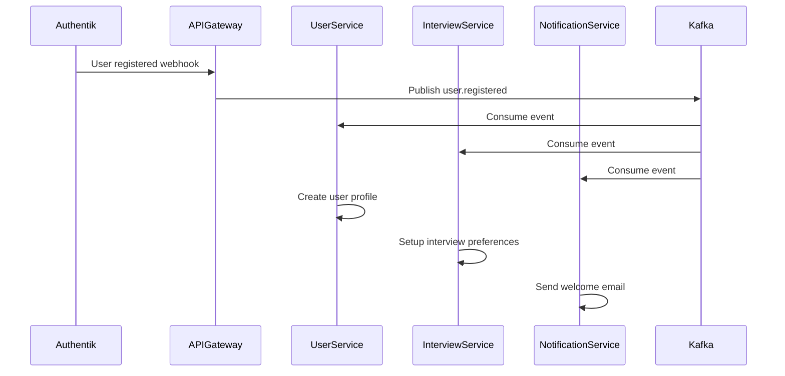

# 📡 Event-Driven Architecture

## Обзор

Платформа использует **Apache Kafka** для реализации event-driven архитектуры, обеспечивающей слабую связанность сервисов и асинхронную обработку событий.

## 🎯 Kafka Topics

### User Events (`user-events`)

**Описание:** События жизненного цикла пользователей  
**Producer:** API Gateway  
**Consumers:** User Service, Interview Service

#### Типы событий:

1. **`user.authenticated`** - Пользователь аутентифицирован
```typescript
{
  eventId: string;
  eventType: 'user.authenticated';
  timestamp: string;
  version: '1.0';
  source: 'api-gateway';
  payload: {
    userId: string;
    email: string;
    sessionId: string;
    authMethod: 'oauth2' | 'jwt_refresh';
    ipAddress?: string;
    userAgent?: string;
  };
}
```

2. **`user.registered`** - Новый пользователь зарегистрирован
```typescript
{
  eventId: string;
  eventType: 'user.registered';
  timestamp: string;
  version: '1.0';
  source: 'api-gateway';
  payload: {
    userId: string;
    email: string;
    registrationMethod: 'authentik';
    firstName?: string;
    lastName?: string;
    company?: string;
  };
}
```

3. **`user.logged_out`** - Пользователь вышел из системы
```typescript
{
  eventId: string;
  eventType: 'user.logged_out';
  timestamp: string;
  version: '1.0';
  source: 'api-gateway';
  payload: {
    userId: string;
    sessionId: string;
    reason: 'manual' | 'timeout' | 'security';
  };
}
```

4. **`user.profile_updated`** - Профиль пользователя обновлен
```typescript
{
  eventId: string;
  eventType: 'user.profile_updated';
  timestamp: string;
  version: '1.0';
  source: 'user-service';
  payload: {
    userId: string;
    updatedFields: string[];
    previousValues?: Record<string, any>;
    newValues?: Record<string, any>;
  };
}
```

### Interview Events (`interview-events`)

**Описание:** События интервью  
**Producer:** Interview Service  
**Consumers:** User Service, Notification Service, Reporting Service

### System Events (`system-events`)

**Описание:** Системные события  
**Producer:** Все сервисы  
**Consumers:** Monitoring Service, Audit Service

## 🏗️ Реализация

### Producer Example (API Gateway)
```typescript
// API Gateway - отправка событий аутентификации
const userAuthEvent = UserEventFactory.createUserAuthenticated(
  userInfo.sub as string,
  userInfo.email as string,
  sessionId,
  { authMethod: 'oauth2' }
);
await this.kafkaService.publishEvent(KAFKA_TOPICS.USER_EVENTS, userAuthEvent);
```

### Consumer Example (User Service)
```typescript
// User Service - обработка событий пользователей
async onModuleInit() {
  await this.kafkaService.subscribe(
    KAFKA_TOPICS.USER_EVENTS, 
    'user-service-group', 
    async (message) => {
      await this.handleUserEvent(message);
    }
  );
}

private async handleUserAuthenticated(event: UserAuthenticatedEvent) {
  // Обновление времени последнего входа
  await this.userRepository.updateLastLogin(event.payload.userId);
  
  // Логирование активности
  await this.activityLogger.log('user_login', event.payload);
}
```

## 🔧 Конфигурация

### Kafka Service Configuration
```typescript
const kafkaService = new KafkaService('service-name');

// Публикация события
await kafkaService.publishEvent(topicName, event);

// Подписка на события
await kafkaService.subscribe(topicName, groupId, handler);
```

### Consumer Groups

- **`user-service-group`** - User Service
- **`interview-service-group`** - Interview Service  
- **`notification-service-group`** - Notification Service
- **`reporting-service-group`** - Reporting Service

## 📊 Event Flow Patterns

### 1. User Authentication Flow


### 2. User Registration Flow


## ✅ Преимущества

1. **Слабая связанность** - Сервисы не зависят друг от друга напрямую
2. **Масштабируемость** - Легкое добавление новых consumers
3. **Надежность** - Kafka обеспечивает доставку сообщений
4. **Аудит** - Все события логируются
5. **Replay capability** - Возможность воспроизведения событий

## 🔍 Мониторинг

### Kafka Metrics
- Message throughput по топикам
- Consumer lag
- Failed messages
- Partition distribution

### Application Metrics
- Event processing time
- Failed event handlers
- Consumer health status

## 🚀 Будущие улучшения

1. **Dead Letter Queue** - Обработка failed events
2. **Event Schema Registry** - Версионирование схем событий
3. **Event Sourcing** - Сохранение состояния через события
4. **CQRS Integration** - Разделение команд и запросов
5. **Saga Pattern** - Распределенные транзакции
