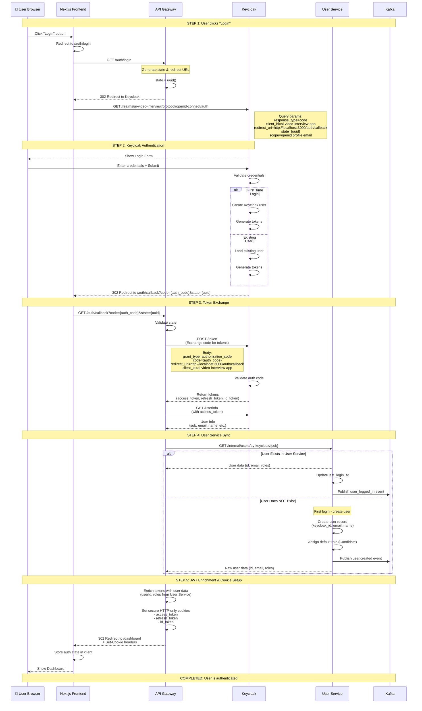
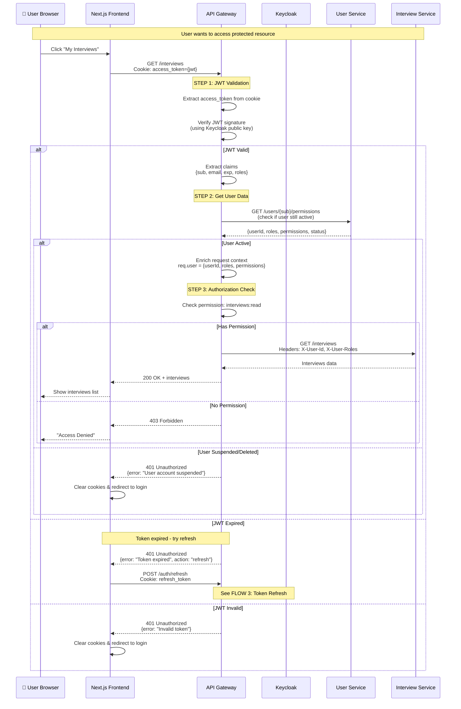
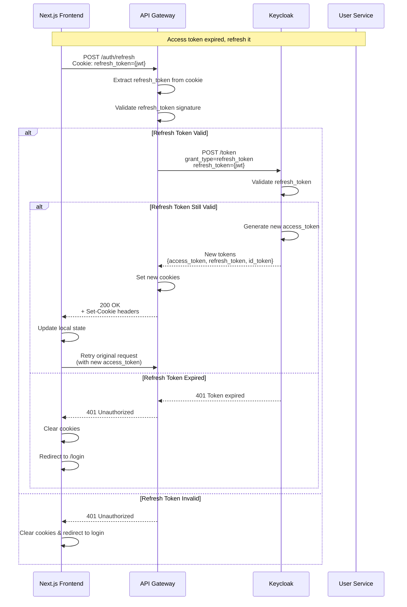
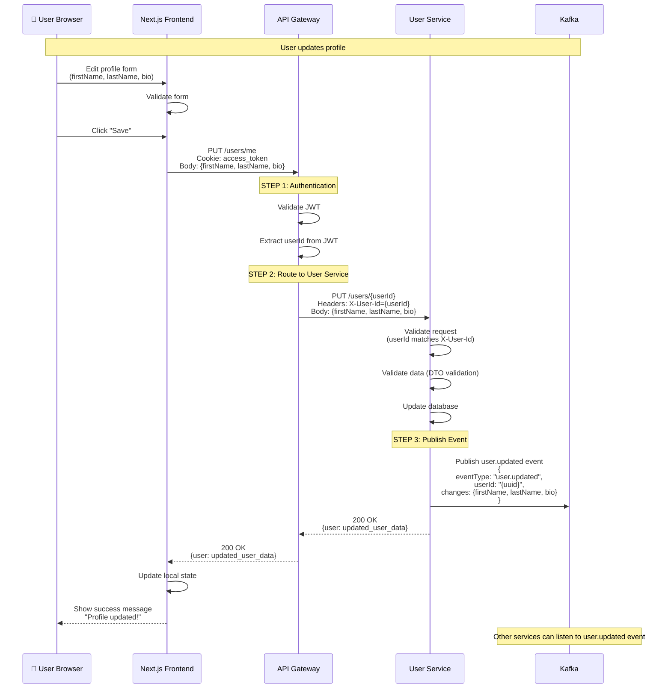
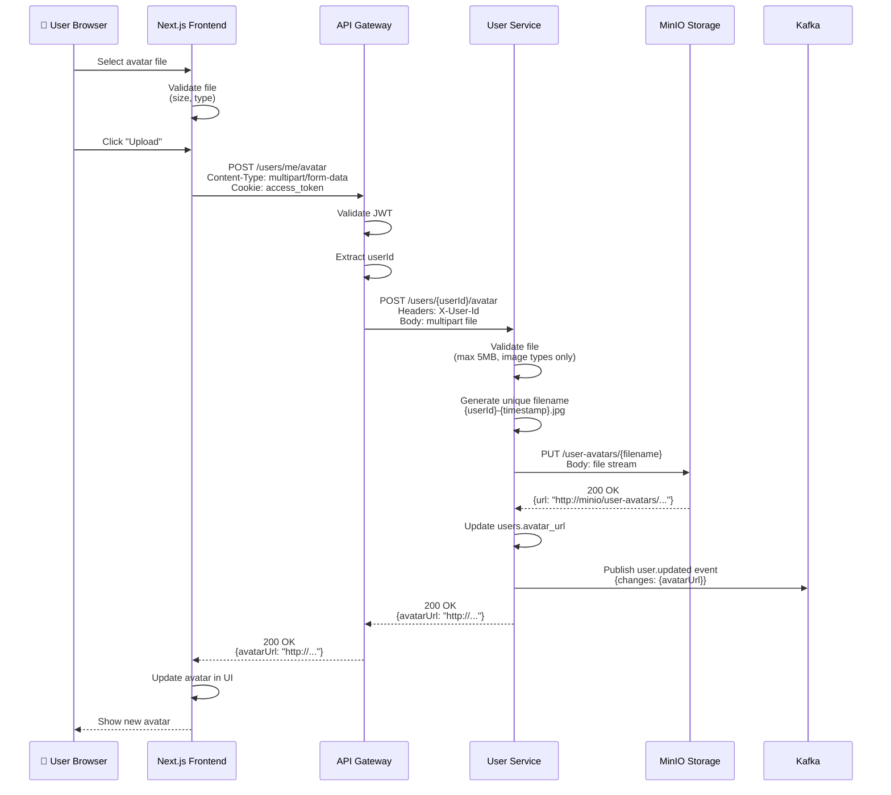
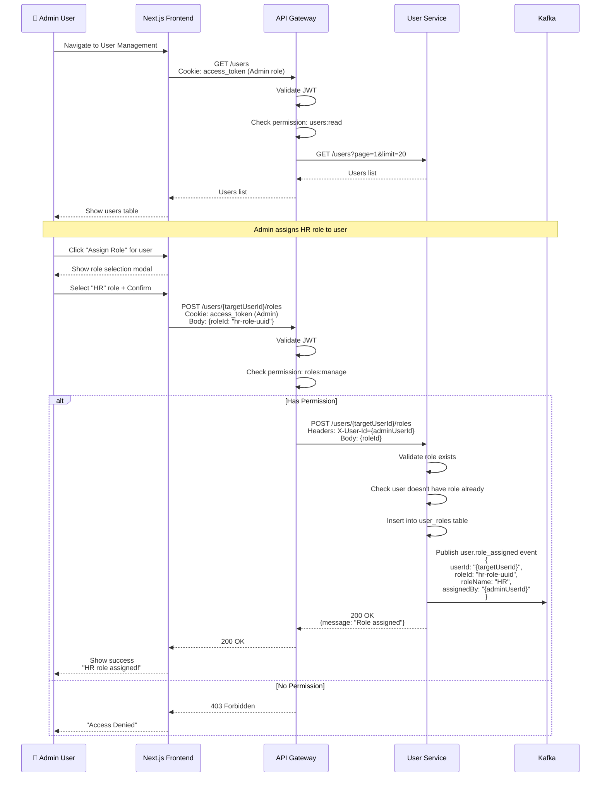

# 🔐 AUTHENTICATION & USER FLOW - Detailed Sequence

## 🎯 Overview

Этот документ описывает детальное взаимодействие между компонентами:
- **Next.js Frontend** - UI
- **API Gateway** - Entry point, auth orchestration
- **Keycloak** - Identity Provider (OAuth2/OIDC)
- **User Service** - User data storage

---

## 📊 FLOW 1: Initial Login & User Creation



---

## 📊 FLOW 2: Protected Resource Access (with JWT validation)



---

## 📊 FLOW 3: Token Refresh



---

## 📊 FLOW 4: User Profile Update



---

## 📊 FLOW 5: Avatar Upload



---

## 📊 FLOW 6: Role Assignment (Admin action)



---

## 🔑 Key Concepts Explained

### **1. JWT Flow:**
```typescript
// JWT содержит:
{
  sub: "keycloak-user-id",           // Subject (Keycloak ID)
  email: "user@example.com",
  preferred_username: "johndoe",
  exp: 1234567890,                   // Expiration timestamp
  iat: 1234567890,                   // Issued at
  aud: "ai-video-interview-app",     // Audience
  iss: "http://localhost:8090/realms/ai-video-interview",
  
  // Custom claims (enriched by API Gateway):
  userId: "user-service-uuid",       // From User Service
  roles: ["HR"],                     // From User Service
}
```

### **2. Cookie Strategy:**
```typescript
// API Gateway sets these cookies:
Set-Cookie: access_token={jwt}; HttpOnly; Secure; SameSite=Strict; Max-Age=300
Set-Cookie: refresh_token={jwt}; HttpOnly; Secure; SameSite=Strict; Max-Age=2592000
Set-Cookie: id_token={jwt}; HttpOnly; Secure; SameSite=Strict; Max-Age=300

// Frontend никогда не видит tokens (HttpOnly)
// XSS protected
```

### **3. User Service as Source of Truth:**
```typescript
// Keycloak хранит:
- Authentication credentials
- OAuth sessions
- Basic profile (email, name)

// User Service хранит:
- Extended profile (bio, phone, avatar)
- Roles & permissions
- Application-specific data
- User preferences
- Activity tracking

// API Gateway обращается к обоим:
1. Keycloak → validate JWT
2. User Service → get roles, check status
```

### **4. Request Headers Enrichment:**
```typescript
// API Gateway добавляет headers при проксировании:
X-User-Id: "123e4567-e89b-12d3-a456-426614174000"
X-User-Email: "user@example.com"
X-User-Roles: "HR,Admin"
X-User-Permissions: "interviews:read,interviews:write"
X-Trace-Id: "trace-uuid"
X-Span-Id: "span-uuid"

// Downstream сервисы могут доверять этим headers
// (так как они приходят из API Gateway, который валидировал JWT)
```

---

## 🔐 Security Considerations

### **1. Where validation happens:**

```typescript
// API Gateway:
✅ JWT signature validation (using Keycloak public key)
✅ JWT expiration check
✅ Cookie extraction
✅ Basic authorization (roles/permissions)
✅ Rate limiting

// User Service:
✅ User exists & active check
✅ Data validation (DTOs)
✅ Business logic validation
✅ Database constraints

// Keycloak:
✅ Credentials validation
✅ OAuth flow
✅ Token generation
✅ Token revocation
```

### **2. Token Invalidation:**

```typescript
// On logout:
1. Frontend → DELETE /auth/logout
2. API Gateway → revoke tokens in Keycloak
3. API Gateway → clear cookies
4. Frontend → clear local state

// On user suspension (Admin action):
1. Admin → PUT /users/{id} {status: "suspended"}
2. User Service → update DB
3. User Service → publish user.status_changed event
4. API Gateway listens → adds user to "suspended" cache
5. Next request → 401 Unauthorized (even if JWT valid)
```

### **3. Role-based Access Control:**

```typescript
// API Gateway checks permissions BEFORE proxying:

@UseGuards(JwtAuthGuard, RolesGuard)
@Roles('Admin', 'HR')
@Post('/interviews')
createInterview() {
  // This route requires Admin OR HR role
  // Gateway checks JWT → extracts roles → allows/denies
}

// If user has role but User Service says suspended:
// → 401 Unauthorized (User Service check happens in JwtAuthGuard)
```

---

## 🚀 Performance Optimizations

### **1. JWT Caching:**
```typescript
// API Gateway caches Keycloak public key:
- Fetch once at startup
- Refresh every 1 hour
- Use for JWT signature validation
- No need to call Keycloak on every request
```

### **2. User Service Caching:**
```typescript
// Cache user permissions in Redis:
Key: user:{userId}:permissions
Value: ["interviews:read", "interviews:write", ...]
TTL: 5 minutes

// On role change → invalidate cache
```

### **3. Connection Pooling:**
```typescript
// API Gateway → User Service:
- HTTP connection pool (keep-alive)
- gRPC for internal communication (future)
```

---

## 📊 Error Handling

### **Common Error Scenarios:**

```typescript
// 1. JWT Expired
Response: 401 Unauthorized
Body: {
  error: "token_expired",
  message: "Access token has expired",
  action: "refresh"  // Frontend should call /auth/refresh
}

// 2. User Suspended
Response: 401 Unauthorized
Body: {
  error: "user_suspended",
  message: "Your account has been suspended",
  action: "logout"
}

// 3. No Permission
Response: 403 Forbidden
Body: {
  error: "forbidden",
  message: "You don't have permission to access this resource",
  required_permission: "interviews:write"
}

// 4. User Service Unavailable
Response: 503 Service Unavailable
Body: {
  error: "service_unavailable",
  message: "User service is temporarily unavailable",
  action: "retry"
}
```

---

## 🔄 Data Consistency

### **How we keep data in sync:**

```typescript
// 1. Keycloak as Primary for Authentication
- User changes password in Keycloak
- No sync needed (User Service doesn't store passwords)

// 2. User Service as Primary for Profile
- User updates profile in User Service
- Keycloak doesn't need to know (it only stores email/name)
- Kafka event published for other services

// 3. Email/Name sync on login
- If email changed in Keycloak:
  → API Gateway sees new email in JWT
  → Calls User Service to update email
  → User Service publishes user.updated event

// 4. Role changes immediate effect
- Admin assigns role in User Service
- Next request → API Gateway gets new roles
- Authorization updated immediately
```

---

## 📈 Monitoring & Observability

### **What to track:**

```typescript
// Metrics:
- auth_login_total (counter)
- auth_login_duration_seconds (histogram)
- auth_token_refresh_total (counter)
- user_service_requests_total (counter)
- jwt_validation_errors_total (counter)

// Logs:
{service_name="api-gateway", category="authentication", action="login_success"}
{service_name="user-service", action="user_created"}
{service_name="api-gateway", level="ERROR", message="JWT validation failed"}

// Traces:
- Full trace from Login button click → Dashboard display
- Spans: Next.js → Gateway → Keycloak → User Service
- Trace ID passed through all services
```

---

## ✅ Summary

### **Component Responsibilities:**

| Component | Responsibility |
|-----------|---------------|
| **Next.js** | UI, Client state, Cookie management, API calls |
| **API Gateway** | Entry point, JWT validation, Authorization, Routing, Token refresh |
| **Keycloak** | Authentication, OAuth2/OIDC, Token generation, User credentials |
| **User Service** | User profiles, Roles, Permissions, User data storage, Kafka events |
| **Kafka** | Event bus, Async communication between services |

### **Flow Summary:**

1. **Login** → Next.js → Gateway → Keycloak → User Service → Kafka
2. **Access Protected Resource** → Next.js → Gateway (validates JWT + checks User Service) → Downstream Service
3. **Token Refresh** → Next.js → Gateway → Keycloak
4. **Profile Update** → Next.js → Gateway → User Service → Kafka

---

**Документация обновлена: 2025-09-30**
**Следующий шаг: Начать implementation User Service! 🚀**
